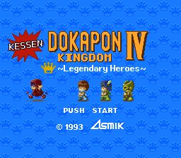
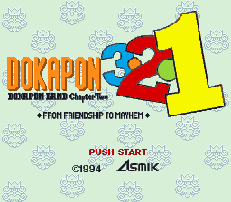
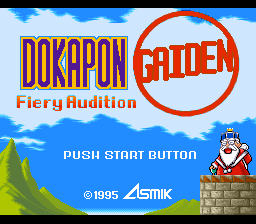
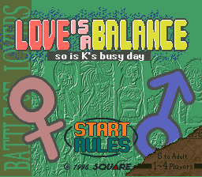
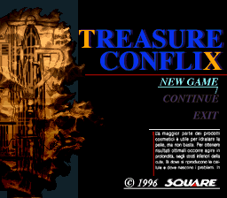
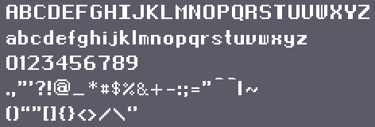
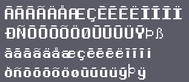

### Hi there 👋

I've been a Java developer since 2010.

Here are some personal projects I've worked on.

# REPROPCBS

PLEASE STOP SELLING MY TRANSLATIONS!!!!

## Super Nintendo Translations

### Kessen! Dokapon Oukoku IV

A translation from Japanese to English of the Super Nintendo game Kessen! Dokapon Oukoku IV - Densetsu no Yuusha-tachi (決戦! ドカポン王国 (ランド) IV 伝説の勇者たち) 
This is the first Dokapon video game, released in 1993.

https://github.com/Krokodyl/kessen-english

### Dokapon 3-2-1

A translation from Japanese to English of the Super Nintendo game Dokapon 3-2-1: Arashi o Yobu Yuujou (ドカポン3・2・1 〜嵐を呼ぶ友情〜) 
This is the second Dokapon video game, released in 1994.

https://github.com/Krokodyl/dokapon-english

### Dokapon Gaiden

A translation from Japanese to English of the Super Nintendo game Dokapon Gaiden 〜Honō no Audition〜 (ドカポン外伝 〜炎のオーディション～) 
 
This is the third Dokapon video game, released in 1995.

https://github.com/Krokodyl/dokapon-gaiden

### Koi wa Balance

A translation from Japanese to English of the Satellaview game Koi wa Balance: Tatoeba K-kun no Tabou na Ichinichi Hen (恋はバランス たとえばK君の多忙な一日編). 
 
This is a multiplayer boardgame developped by Squaresoft in 1996.

https://github.com/Krokodyl/koi-wa-balance

### Treasure Conflix

A translation from Japanese to English of the Satellaview game Treasure Conflix. 
 

https://github.com/Krokodyl/treasure-conflix

## Font

### Final French

An 8-bit style font for the latin alphabet (Basic and More), inspired by the Final Fantasy games.

https://github.com/Krokodyl/latin-font

## Boardgames

### Battle Royal

A recreation of all the assets for an old boardgame from the 1950s. 
All done using Photoshop.

https://github.com/Krokodyl/battle-royal

<!--
**Krokodyl/Krokodyl** is a ✨ _special_ ✨ repository because its `README.md` (this file) appears on your GitHub profile.

Here are some ideas to get you started:

- 🔭 I’m currently working on ...
- 🌱 I’m currently learning ...
- 👯 I’m looking to collaborate on ...
- 🤔 I’m looking for help with ...
- 💬 Ask me about ...
- 📫 How to reach me: ...
- 😄 Pronouns: ...
- ⚡ Fun fact: ...
-->
